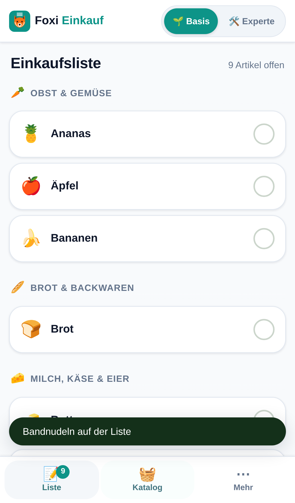
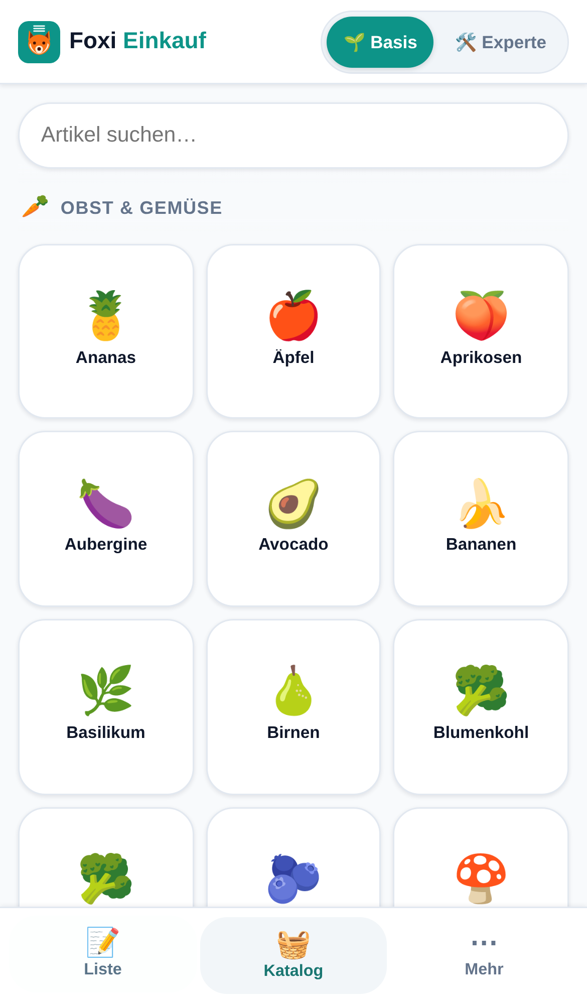
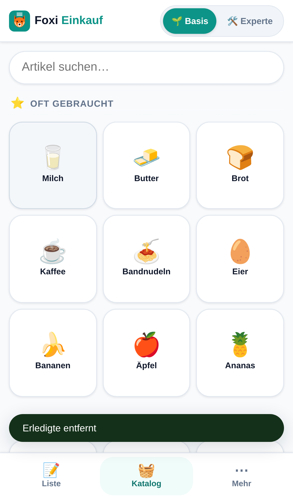
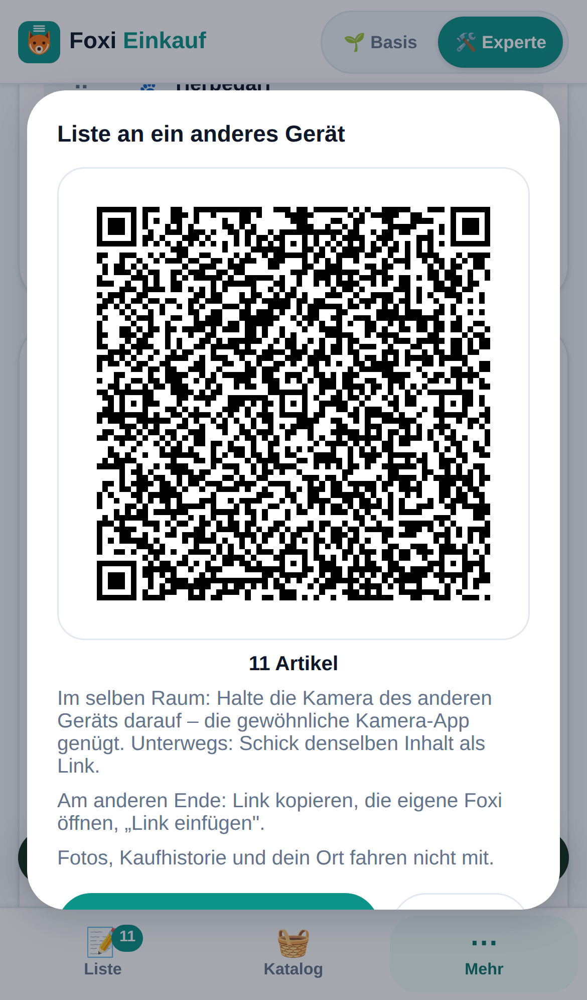
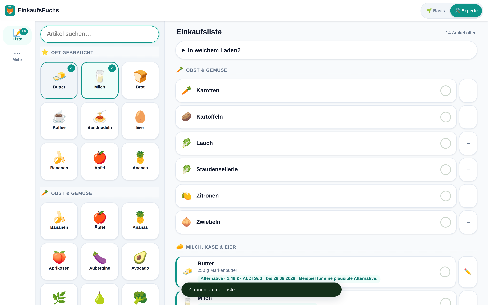

# EinkaufsFuchs – Einkaufsliste für Haushalt, Familie und WG


**Tippen statt Tippen.**

**EinkaufsFuchs**, kurz **Foxi**, ist eine Einkaufsliste als Progressive Web App. Artikel kommen durch
Antippen einer Kachel auf die Liste, nicht durch Schreiben. Im Laden tippt man
sie erneut an, um sie abzuhaken. Der Katalog merkt sich dabei, was dieser
Haushalt tatsächlich braucht, und sortiert sich danach – ohne Menüpunkt, ohne
Einstellung, ohne Erklärung.

EinkaufsFuchs gehört zur selben Werkstatt wie
[TourFuchs](https://github.com/gunterstruck/tourfuchs) und
[SoundFuchs](https://github.com/gunterstruck/SoundFuchs) und benutzt deren
Gestaltung: dieselben Radien, Schatten, Abstände und denselben
Basis/Experte-Schalter und exakt dieselbe Petrol-Farbpalette. Das Zeichen über
dem Fuchskopf benennt die Aufgabe: Bei Foxi sind es drei Listenstriche.

### Zwei Namen, eine App

**EinkaufsFuchs** steht dort, wo die App sich vorstellt: Fenstertitel,
Startbildschirm, Fußzeile, weitergegebene Texte. Er stellt sie neben ihre
Geschwister, wo sie hingehört.

**Foxi** steht dort, wo sie benutzt wird. „Hol das mal in Foxi rein" sagt
sich leichter als das Kompositum – und in einer Kopfzeile von 360 px
konkurriert der kurze Name nicht mit dem Tiefenschalter. Ab 420 px
Bildschirmbreite wechselt die Kopfzeile auf den vollen Namen; der jeweils
andere steht auf `display: none` und damit auch nicht im Barrierebaum, sodass
Vorlesehilfen genau einen Namen zu hören bekommen.

Zwei Bezeichner bleiben bewusst auf `foxi`, obwohl sie es nicht mehr müssten:
der Name der IndexedDB-Datenbank und die Typkennung im Dateikopf der
Austauschdatei. Ein neuer Datenbankname wäre eine neue, leere Datenbank – jede
bestehende Installation verlöre Liste, Kaufhistorie und eigene Artikel. Und
eine neue Typkennung ließe Foxi seine eigenen älteren Dateien als „fremd"
abweisen. Ein Bezeichner ist kein Schaufenster: Er darf alt aussehen, solange
er stimmt.

---

## Der Grundsatz, dem alles untergeordnet ist

**Alle Daten bleiben auf dem Gerät.** Keine Cloud, kein Konto, kein Login, kein
Backend, kein Analytics, keine externen Anfragen im Normalbetrieb. Wenn eine
Funktion diesen Grundsatz brechen würde, wird sie nicht gebaut.

Zweitens: **Einfachheit ist die Hauptfunktion.** Im Zweifel weglassen. Die App
muss ohne Erklärung bedienbar sein.

Foxi ist kostenlos und wird offen weitergegeben. Es gibt kein Geschäftsmodell,
keine Werbung, kein Tracking.

---

## Bilder

| Liste | Katalog | Gelernt |
|---|---|---|
|  |  |  |

Das dritte Bild ist der Punkt der ganzen App: Nach zehn Einkäufen stehen die
Standardartikel des Haushalts unter „Oft gebraucht" ganz oben. Dafür hat
niemand etwas eingestellt.

---

## Die vier Kernfunktionen

### 1. Kacheln statt Tippen
Artikel werden angetippt, nicht geschrieben. Die Kacheln sind quadratisch,
mindestens 98 px breit und mit einer Hand erreichbar. Getippt wird nur im
Ausnahmefall: wenn der Katalog etwas nicht kennt.

### 2. Automatische Kategorien
Jeder Artikel trägt eine Kategorie. Die Liste gruppiert danach, in der
Reihenfolge eines durchschnittlichen Supermarkt-Laufwegs – man geht den Laden
einmal ab statt viermal. Die Reihenfolge wird im Expertenmodus anpassbar.

### 3. Rezepte und Vorlagen
Ein Rezept ist ein Name und eine Artikelliste. Ein Tipp überträgt alle Zutaten
auf einmal. Kein Web-Import, keine Rezeptdatenbank, keine Bilder.

Eigene Rezepte entstehen aus dem, was gerade auf der Liste steht – das ist der
einzige Weg, und er ist Absicht. Ein eigener Zusammenbau-Bildschirm
(„Zutaten auswählen") wäre ein zweiter Katalog mit zweiter Suche, für eine
Aufgabe, die man einmal im Monat hat.

### 4. Der lernende Katalog
Bei jedem Abhaken wandert ein Zeitstempel in `letzteKaeufe`. Daraus entsteht
ein Wert, der mit dem Alter abklingt (Halbwertszeit 30 Tage). Der Katalog
sortiert sich danach.

Warum überhaupt vergessen? Ohne Verfall gewinnt ewig, was man einmal einen
Monat lang täglich gekauft hat – und die Kachel steht noch oben, wenn das Kind
längst ausgezogen ist.

### Wochenangebote mit KI – lokal gesteuert

Im Basismodus lässt sich ein persönlicher Angebotscheck erproben, ohne Foxis
Netzwerkregel aufzuweichen. Eine einmalige Einführung erklärt die drei
bewussten Schritte: Auftrag kopieren, KI-Recherche-Assistenten wählen,
Ergebnis wieder einlesen. Der Auftrag wird aus den aktivierten Märkten, der
aktuellen Liste und häufig gekauften Produkten lokal zusammengestellt.
„Meine Märkte“ bleibt ebenso wie die Liste auf dem Gerät.

Foxi recherchiert dabei nicht selbst. Es bleibt die lokale Seite der Brücke:
Bedarf hinaus, geprüfte Treffer herein – beides nur nach einer bewussten
Handlung. Treffer stehen anschließend direkt an passenden Artikeln der
Einkaufsliste. Gleiche Angebote mehrerer Filialen werden zusammengefasst;
Preis, Händler mit Filiale und Ablaufdatum bleiben direkt sichtbar.
Bestpreis-Hinweise gibt es nur für tatsächlich vergleichbare Grundpreise.
Der vollständige Ablauf steht unter
[docs/angebotsradar-pilot.md](docs/angebotsradar-pilot.md).

---

## Basis und Experte

Der Schalter im Kopfbereich blendet Funktionen ein und aus. **Es ist keine
Bezahlschranke** – alles ist immer kostenlos, es geht ausschließlich um
sichtbare Komplexität.

| | Basis (Standard) | Experte |
|---|---|---|
| Liste, Katalog, Abhaken | ✅ | ✅ |
| Artikelblatt: Wunsch, Foto und Angebote je Artikel | – | ✅ |
| Rezepte | – | ✅ |
| Kategorie-Reihenfolge ziehen | – | ✅ |
| Teilen, Export, Import und Vollsicherung | ✅ | ✅ |
| Liste als QR-Code oder Link an ein anderes Gerät | ✅ | ✅ |
| Briefing-Export als Klartext | – | ✅ |
| Stammartikel-Export | – | ✅ |
| Wochenangebote mit KI | ✅ | ✅ |
| Ort für die Texte hinterlegen | – | ✅ |
| Statistik | – | ✅ |

Der Wechsel ist jederzeit und **verlustfrei** möglich, und zwar wörtlich: Er
berührt genau einen Wert in den Einstellungen. Eine Menge, die im
Expertenmodus entstanden ist, steht in der Datenbank weiter – Basis zeigt sie ebenfalls an; bearbeitet wird sie im Artikelblatt des Expertenmodus.

---

## Die Liste als QR-Code

Von Gerät zu Gerät, ohne Datei und ohne Zwischenablage: **Bildschirm zeigt,
Kamera liest.**



Unter *Mehr → Teilen und Sichern* zeigt Foxi die offene Liste als QR-Code –
am Schreibtisch, auf dem Tablet oder von einem Handy zum anderen. Das andere
Gerät hält einfach seine **gewöhnliche Kamera-App** darauf und tippt auf die
Benachrichtigung; Foxi öffnet sich dort mit derselben Liste und fragt, was
übernommen werden soll. Einen Scanner braucht es nicht.

Die Daten stehen im Anker der Adresse – und alles hinter dem Rautezeichen
schickt kein Browser zu irgendeinem Server. Ein Wocheneinkauf mit 25 Artikeln
passt bequem in einen einzigen Code.

**Unterwegs geht derselbe Inhalt als Link.** „Als Link senden" legt ihn in
WhatsApp, Threema, Signal oder eine Mail – für den Fall, für den der QR-Code
nichts taugt: Einer ist zu Hause, der andere im Laden.

Am anderen Ende gehört dann **„Link einfügen"** dazu, und das ist kein
Beiwerk: Ein angetippter Link öffnet den eingebauten Browser des Messengers,
und der hat seinen eigenen Speicher – dort übernommen, wäre die Liste in der
richtigen Foxi nie angekommen. Der Weg ist deshalb: Link kopieren, die eigene
Foxi öffnen, einfügen.

**Was nicht mitfährt:** Fotos (ein Produktfoto ist dreitausendmal so groß wie
ein QR-Code fasst), die Kaufhistorie, die gelernten Mengen und dein Ort.

---

## Handy und Schreibtisch

Die zweite Achse, und sie wird nicht eingestellt, sondern gemessen: **Quer
ist Schreibtisch, hoch ist Handy.**

| | Handy-Schnitt | Schreibtisch-Schnitt |
|---|---|---|
| Navigation | Leiste unten | Leiste links |
| Katalog | hinter seinem Reiter | dauerhaft in der linken Spalte |
| Arbeitsfläche | ein Bereich | Liste (oder Mehr) rechts daneben |



Am Schreibtisch – und auf dem **quer gehaltenen Tablet** – steht links die
Eingabeseite und rechts die Arbeitsfläche, wie bei TourFuchs und SoundFuchs.
Eine Kachel links legt den Artikel in die Liste rechts, ohne Reiterwechsel.

Im **Hochformat** bleibt auch ein breites Tablet in der Handy-Ansicht: Der
Daumen an der unteren Leiste ist dort die bessere Bedienung. Und das
**Telefon** bekommt in jeder Lage den Handy-Schnitt – quer ist es zwar breit
genug, aber keine 480 px hoch, und zwei Spalten in 400 px Höhe wären ein
Briefschlitz.

Es gibt **keine Funktion, die es nur am Schreibtisch gibt.** Beide Schnitte
zeigen dieselbe App; Einfachheit gilt auf jeder Bildschirmgröße.

---

## Loslegen

```bash
git clone https://github.com/gunterstruck/einkaufsfuchs.git
cd einkaufsfuchs
npm run dev        # http://localhost:8080
```

`npm install` ist dafür nicht nötig: Foxi hat **keine Laufzeit-Abhängigkeiten**
und keinen Bauschritt. Der kleine Server in `tools/server.mjs` existiert nur,
weil ES-Module und Service Worker eine echte Herkunft (`origin`) verlangen –
`file://` genügt nicht.

Veröffentlichen heißt: den Ordner auf einen beliebigen statischen Webspace
kopieren. Kein Node, kein Build, kein Container.

### Veröffentlichen auf Vercel

Das Repository ist fertig eingerichtet – `vercel.json` liegt bei. In Vercel
genügt **Add New… → Project → `gunterstruck/einkaufsfuchs` importieren → Deploy**.
Nichts umstellen: Framework `Other`, Install- und Build-Command leer, Output
Directory `.`; genau das steht in `vercel.json` und wird von dort gelesen.

Danach baut jeder Push auf `main` automatisch neu.

Die installierte PWA prüft unmittelbar beim Start, bei der Rückkehr aus dem
Hintergrund und während einer offenen Sitzung regelmäßig auf eine neue
Fassung. Ein neuer Service Worker wartet, bis alle offenen Foxi-Fenster geschlossen sind. So verliert ein geöffnetes Artikelblatt keine Eingaben. Danach wird die vollständig zwischengespeicherte neue Fassung aktiviert. Seiten und Module kommen stets aus derselben Cache-Version; IndexedDB bleibt erhalten.

`vercel.json` setzt außerdem die Kopfzeilen, die zum Grundsatz gehören:

- **`Content-Security-Policy: default-src 'self'`** – der eigentliche Punkt.
  Foxi *behauptet* nicht nur, keine fremden Adressen aufzurufen; der Browser
  lässt es gar nicht erst zu. Das geht nur, weil im Markup kein einziges
  Inline-Skript und keine Inline-Formatierung steht.
- **`Permissions-Policy`** schaltet Standort, Mikrofon, Kamera, USB,
  Bluetooth und Bezahlschnittstellen ab. Foxi braucht nichts davon, und was
  abgeschaltet ist, kann auch kein späterer Fehler versehentlich benutzen.
- **`Referrer-Policy: no-referrer`**, `X-Content-Type-Options: nosniff`.
- `sw.js`, `manifest.webmanifest` und alles unter `src/` gehen mit
  `must-revalidate` heraus. Die Dateinamen tragen keine Prüfsumme – ein
  langer Browser-Zwischenspeicher würde nach einer neuen Fassung alte
  Dateien ausliefern, an denen der Service Worker nichts mehr ändern kann.

Ein Hinweis zur Genauigkeit: `.vercelignore` wirkt nur beim Hochladen über
die Vercel-CLI. Bei der Git-Anbindung liegt das ganze Repository im Build,
und mit `outputDirectory: "."` sind `tools/`, `tests/` und `docs/` auch unter
der Adresse erreichbar. Das ist kein Leck – dieselben Dateien liegen ohnehin
öffentlich auf GitHub –, aber es ist erwähnenswert, statt es zu verschweigen.

### Prüfen

```bash
npm install && npm test          # 239 Unit-Tests (Logik, Daten, Import, PWA und Designsystem)

npm i --no-save playwright && npx playwright install chromium
node tools/durchlauf.mjs         # 105 Prüfungen im echten Browser + Bilder
node tools/update-lauf.mjs       # 8 Prüfungen: Update mit zwei offenen Fenstern
node tools/alltag-lauf.mjs       # 20 Prüfungen: Alltagsfunktionen, KI-Auftrag senden und kopieren, Gerätewechsel und Vollsicherung
```

Die Prüfstrecke (105 Prüfungen) fährt die Abnahmekriterien ab, die man mit
Unit-Tests nicht erreicht: die Zwei-Tipp-Regel, zehn simulierte Einkäufe, den
verlustfreien Moduswechsel, Rezepte, das Ziehen der Kategorien mit Zeiger und
mit Tastatur, den Briefing-Export aus der echten Zwischenablage und einen
vollständigen Datei-Import samt Zusammenführungs-Dialog.

Zwei Tore laufen dabei ständig mit: Sie schreibt **jede Netzwerkanfrage** mit –
eine fremde Adresse lässt den Lauf durchfallen –, und der
Entwicklungsserver schickt **dieselbe Content-Security-Policy wie die
Auslieferung**, sodass ein Verstoß hier auffällt statt erst im Betrieb.

---

## Aufbau

```
index.html                 Gerüst: Kopf, drei Bereiche, untere Leiste
manifest.webmanifest       Installierbarkeit
sw.js                      Service Worker (Zwischenspeicher = die ganze App)
src/
  app.js                   Start und Zusammenspiel
  zustand.js               Zustand im Speicher, Durchschreiben nach IndexedDB
  db.js                    IndexedDB, sonst nichts
  logik.js                 reine Rechenregeln (getestet, ohne DOM)
  texte.js                 alle sichtbaren Sätze an einem Ort
  version.js
  daten/katalog.json       476 Artikel in 18 Kategorien
  daten/rezepte.json       sechs Beispielrezepte
  ui/schale.js             Kopf, Bereichswechsel, Rückmeldung
  ui/liste.js              Bildschirm 1
  ui/katalog.js            Bildschirm 2
  ui/mehr.js               Bildschirm 3
  ui/teilen.js             Datei, Klartext, Import
  ui/dialog.js             der eine Dialog, den es braucht
  styles/stamm/            Zeile für Zeile aus TourFuchs übernommen
  styles/farben.css        die Grenzschicht: was Foxi anders macht
  styles/foxi.css          Kachelwand, Liste, untere Leiste
tools/                     Katalog bauen, Zeichen rastern, Server, Prüfstrecke
tests/                     Unit-Tests
```

### Warum kein Framework

Foxi hat drei Bildschirme, einen Zustand und keine Fremddaten. React oder
Vue würden hier eine Abhängigkeit, einen Bauschritt und eine Bündeldatei
einführen, um Listen neu zu zeichnen, die sich mit `textContent = ''` und
einer Schleife genauso schnell neu zeichnen lassen. Der teuerste Vorgang der
App – 476 Kacheln neu aufbauen – wird nicht dadurch billiger, dass ein
virtueller Baum davorsteht; er wird dadurch billig, dass er meistens gar nicht
stattfindet (siehe `veraltet` in `app.js`).

### Datenmodell

```
artikel     { id, name, kategorieId, icon, zaehler, letzteKaeufe[], eigen }
listeItem   { artikelId, menge, notiz, erledigt, erledigtAm }
kategorie   { id, name, icon, position }
rezept      { id, name, artikelIds[] }
einstellung { schluessel, wert }        // u. a. modus: "basis" | "experte"
```

`letzteKaeufe` ist ein Array von Zeitstempeln und das Herzstück: Daraus speist
sich die lernende Sortierung – und später die Rhythmus-Erkennung.

---

## Bewusst nicht gebaut

| Funktion | Grund |
|---|---|
| ~~QR-Code-Sync~~ | **Gebaut in 0.11.0** – siehe „Die Liste als QR-Code". Die alte Begründung stimmte für das alte Format |
| Barcode-Scan | Safari/iOS unterstützt `BarcodeDetector` nicht; eine Produktdatenbank wäre ein Netzwerk-Request |
| Kassenbon-OCR | Thermopapier ist der Worst Case für OCR; die Kaufhistorie entsteht ohnehin beim Abhaken |
| Spracheingabe | Die Web Speech API sendet Audio an Google/Apple – bricht den Grundsatz |
| Direkte automatische Händleranbindung | Keine stabilen öffentlichen Schnittstellen; würde Foxis lokale Architektur aufweichen |
| Konto, Login, Cloud-Sync | Widerspricht dem Grundsatz |

### Warum Angebote trotzdem funktionieren – ohne Händleranbindung

Foxi lädt selbst keine Händlerpreise. Stattdessen trennt es lokalen Bedarf und
wechselnde Webrecherche sauber voneinander.

Am 30.08.2026 hat ein KI-Agent auf Zuruf die aktuellen Lebensmittelangebote
eines Discounters von dessen Angebotsseite gelesen: 178 Einträge aus 16
Kategorien und drei Aktionszeiträumen, mit Aktionspreis, Grundpreis und
Gebindegröße. Das zeigt: Ein Recherche-Assistent kann die schnell alternde
Außenwelt prüfen, während Foxi lokal, offline und anbieterunabhängig bleibt.

Genau dafür gibt es jetzt den geführten Angebotscheck. Foxi erstellt einen
strukturierten Rechercheauftrag, der Mensch übergibt ihn bewusst, und Foxi
prüft das zurückgegebene Ergebnis streng vor dem lokalen Speichern.

Und deshalb hängt an diesem Export **keine vorformulierte Frage**. Derselbe
Textblock trägt „was ist davon gerade im Angebot", „was koche ich daraus" und
„erklär mir Sardellenpaste". Eine mitgelieferte Frage würde all das auf einen
Fall verengen und mit den Fähigkeiten der Modelle altern. Ein reiner
Textblock wächst mit ihnen.

Eine direkte Händleranbindung wäre in beide Richtungen der schlechtere Tausch:
Sie bräuchte eine dauerhafte Netzverbindung, einen Anbieter und laufende
Pflege – und sie wäre an dessen Schnittstellen gebunden.

**Zwei Exporte, zwei Fragen.** „Liste als Text kopieren" beantwortet, was
heute fehlt. „Stammartikel kopieren" beantwortet die interessantere Frage:
was dieser Haushalt *immer* braucht, mit der Kaufzahl dahinter
(`Milch (23×), Kaffee (11×), …`). Erst damit lässt sich draußen fragen, ob
etwas davon gerade billiger ist – und das ist die Frage, die man sich selbst
nicht beantworten kann, weil ihre Antwort jede Woche wechselt.

Dazu gibt es im Expertenmodus ein Feld für **Postleitzahl und Ort**. Auch diese
Angabe verlässt das Gerät nur, wenn ein Mensch einen erzeugten Text selbst
weitergibt. Foxi schlägt damit nichts nach und schickt nichts weg.

Produktwunsch und optionales Produktfoto gehören zum Artikel, nicht nur zum
heutigen Einkaufszettel. Beim nächsten Hinzufügen sind sie wieder da. Fotos
werden vor dem lokalen Speichern verkleinert und weder in den KI-Auftrag noch
in den normalen Listenexport aufgenommen.

---


## Neu in 0.15.1

- **„Nur neue“ lässt den Produktwunsch jetzt wirklich stehen.** Wer eine geteilte Liste mit „Nur neue“ übernahm, dem überschrieb sie stillschweigend den gelernten Produktwunsch – aber nur bei Artikeln, die gerade nicht auf der eigenen Liste standen. Aus „Vollmilch 3,5 %“ wurde dauerhaft das, was auf der fremden Liste stand, und zwar für jedes künftige Aufnehmen. Der Wunsch bleibt jetzt; nur „Alles übernehmen“ ersetzt ihn. Ein Artikel ohne eigenen Wunsch nimmt den aus der Datei weiterhin an.
- **„Liste leeren“ und „Foxi zurücksetzen“ fragen im eigenen Dialog** statt im Systemfenster des Browsers. Das alte Fenster trug in der installierten App die Adresse der Seite in der Überschrift – und manche Browser unterdrücken es ganz, dann lief ausgerechnet das Zurücksetzen ohne Rückfrage durch.
- **Unter der Haube:** Der Service Worker schrieb bei jedem Start die Schale ohne Grund in den Zwischenspeicher zurück; ein voller Speicher konnte dabei unbemerkt einen Fehler hinterlassen. Und die Datenbank öffnet nicht mehr mehrfach parallel und erholt sich, wenn der Browser die Verbindung von sich aus schließt.

## Neu in 0.15.0

- **Der KI-Auftrag kennt jeden Händler einzeln.** Die acht Angebotsseiten wurden am 23.09.2026 neu geprüft, diesmal wie ein Mensch sie benutzt: Cookie-Hinweis bestätigen, scrollen, Produktseiten öffnen. Ergebnis: ALDI Nord, ALDI Süd, Kaufland und PENNY zeigen Preise im Text, EDEKA, Netto und PENNY erst nach der Marktwahl vollständig, Lidl nur als Prospekt aus Seitenbildern, REWE stellte eine Sicherheitsabfrage. Der Auftrag enthält für jeden Händler aus dem Profil genau diesen Weg.
- **Preis ohne App und Karte.** App-, Coupon- und Kundenkartenpreise („App Preis“, „Nur mit App“, „Kaufland Card“, Lidl Plus) werden nicht als Preis übernommen, höchstens im Hinweis genannt.
- **Angebote nur mit Beginn** („Im Angebot ab 24.09“) gelten bis Samstag derselben Woche und tragen sichtbar „Kein Enddatum angegeben – solange Vorrat reicht“.
- **ALDI Süd verlangt jetzt die Filiale**, weil die Seite sonst selbst eine nach Standort wählt.
- Sind alle Treffer eines Artikels gleich teuer, entfällt die Marke „Niedrigster gefundener Grundpreis“.

## Neu in 0.14.2

- **Die untere Leiste bleibt erreichbar – auch nach schnellem Doppeltipp.** Wer in der Liste zweimal kurz auf dieselbe Zeile tippt (abhaken, gleich wieder zurückholen), löste auf dem iPhone den Doppeltipp-Zoom aus. Die App war dann herangezoomt, und Liste, Katalog und Mehr lagen außerhalb des Bildes. Der Doppeltipp-Zoom ist jetzt aus; mit zwei Fingern zoomen geht weiterhin.
- **Der Rahmen hängt an den Bildschirmkanten** statt an einer berechneten Bildschirmhöhe, die installierte Web-Apps nach Tastatur oder Rückkehr aus dem Hintergrund zeitweise falsch meldeten. Beim Zurückkehren aus dem Hintergrund prüft Foxi außerdem, ob die Ansicht verschoben ist, und holt sie zurück.

## Neu in 0.14.1

- **„An KI-App senden“.** Am Handy öffnet der Hauptknopf das Teilen-Menü: Claude oder ChatGPT wählen, und der Rechercheauftrag landet direkt in der App – mit dem Konto, das dort angemeldet ist. Vorher führte der Weg über die Zwischenablage und einen Link, und ein Link aus der installierten Web-App öffnet den Browser, nicht die App.
- **Kopieren hat einen zweiten Weg.** Verweigert das Gerät die moderne Zwischenablage, kopiert Foxi zusätzlich auf dem älteren, synchronen Weg. Erst wenn beide scheitern, zeigt es den Text zum Kopieren von Hand.
- Die Links zu den Assistenten heißen jetzt ehrlich „Im Browser öffnen“.

## Neu in 0.14.0

- **Die Filiale steht immer dabei.** Auf der Einkaufsliste heißt ein Angebot jetzt „Angebot · 0,99 € · ALDI Nord Schürmannstraße 43b · bis …“ statt nur „ALDI Nord“. Gilt es in mehreren Filialen, steht die erste beim Namen und die übrigen gezählt; bei mehreren Angeboten die Filiale des günstigsten. Unter „Mehr“ stehen alle Filialen in der Zeile, die vollständigen Adressen aufklappbar.
- **Angebote ohne bekannte Filiale bleiben draußen.** Beim Einlesen ordnet Foxi jedes Angebot einer Filiale aus „Meine Märkte“ zu – auch in anderer Schreibweise („Rellinghauser Str. 239, 45136 Essen“ trifft „Rellinghauser Straße 239, Essen“). Sammelangaben wie „alle Filialen“ oder fremde Filialen werden weggelassen, und die Meldung sagt, wie viele.
- **Ein Auftrag, der weiß, wo die Preise stehen.** Die acht Händlerseiten wurden mit einem echten Browser geprüft: Keine zeigt Angebotspreise im bloßen Seitentext, PENNY verlangt eine Marktwahl, vier Seiten wiesen die Messung ab. Der Rechercheauftrag sagt dem Assistenten deshalb, dass er die Seiten darstellen und den Prospekt öffnen muss, bei welchen Händlern aus dem Profil die Preise je Filiale gelten und dass er die Gültigkeit von der Seite nimmt.
- **Nicht gelesen statt geraten.** Kommt der Assistent an eine Filiale nicht heran, trägt er sie in `nichtGelesen` ein. Foxi zeigt diese Filialen mit Grund an – damit „kein Angebot“ nicht mit „nicht nachgesehen“ verwechselt wird. Das Feld ist freiwillig; ältere Ergebnisse bleiben gültig.

## Neu in 0.13.0

- **Diese Woche wieder?** Bis zu fünf begründete Vorschläge aus mindestens drei verschiedenen Kauftagen. Ein stabiler Rhythmus zählt; sehr alte oder unregelmäßige Käufe erzeugen keine Empfehlung. „Noch genug“ verschiebt einen Vorschlag lokal um zwei bis sieben Tage.
- **Mein Laden merkt sich den Weg.** Einen gespeicherten Laden wählen, Einkauf starten und am Ende beenden. Nach mindestens drei Einkäufen mit je drei Kategorien bietet Foxi eine Reihenfolge an. Sie gilt erst nach ausdrücklicher Übernahme und nur beim Einkauf in diesem Laden. Kein GPS, keine Karte, keine Cloud.
- **Was hat sich geändert?** Dateien und Links tragen eine anonyme Absenderkennung und einen Stand. Beim erneuten Empfang vergleicht Foxi mit dem zuletzt übernommenen Stand. Neue Artikel und Mengenänderungen werden einzeln gezeigt; Konflikte und Löschungen sind nicht vorausgewählt. Alte Links überschreiben keinen neueren Stand. Das ist bewusster Austausch, kein Live-Sync. Ältere Dateien und Links funktionieren weiterhin über den bisherigen Importdialog.
- **Acht verbreitete Händler plus eigene Läden:** ALDI Nord, ALDI Süd, Lidl, REWE, EDEKA, Kaufland, Netto Marken-Discount und PENNY. Bei „Sonstiger Laden“ stehen Name und Adresse im Filialfeld. Eine eigene offizielle HTTPS-Angebotsseite kann ausdrücklich hinterlegt werden. Foxi erlaubt dann diesen Host für genau diesen Laden; Preise und Kalenderdaten werden weiterhin geprüft. Eine akzeptierte Datei ist kein Nachweis dafür, dass der Händler den Preis tatsächlich anbietet.
- **Teilen und Vollsichern auch in Basis.** Die normale Liste bleibt ohne Kaufhistorie oder Fotos. Die getrennte Vollsicherung enthält alle lokalen Speicher und ersetzt sie nach Bestätigung atomar. Sie ist privat und unverschlüsselt; vor Wiederherstellung andere Foxi-Fenster schließen. Ein wiederhergestelltes Gerät erhält beim nächsten Teilen eine neue Absenderkennung.
- **Fehlerkorrekturen:** unterbrochene Erstbefüllung reparieren, Updates ohne erzwungenen Neustart, erledigte Rezeptzutaten erneut übernehmen, Gesamt-Kaufzahlen über 60 korrekt anzeigen und unmögliche Kalendertage ablehnen. Mengen bleiben auch im Basismodus sichtbar.

## Stand und was als Nächstes kommt

**Gebaut (v0.15.1):** Version 1 ist inhaltlich vollständig – Basismodus,
lernender Katalog, Rezepte, Kategorie-Reihenfolge per Ziehen, Teilen als
Datei mit Zusammenführung beim Import, Briefing-Export, Statistik,
Offlinebetrieb, Installierbarkeit. Der geführte Angebotscheck verbindet Foxis
lokalen Bedarf mit einem frei gewählten KI-Recherche-Assistenten; er ist keine
automatische Händleranbindung.

Seit 0.9.0 führt der Knopf neben einer Listenzeile ins **Artikelblatt**:
Produktwunsch, Foto und alle Angebote zu diesem Artikel – mit Händler,
Grundpreis, Filialen und Verweis auf die Händlerseite. Die Listenkarte selbst
bleibt dabei ein ungeteiltes Ziel zum Abhaken; warum das so ist, steht in
[docs/KONZEPT.md](docs/KONZEPT.md), Kapitel 4.1.

Seit 0.9.1 steht dort auch **„Zuletzt so gekauft"**: Beim Abhaken merkt sich
Foxi den Produktwunsch, der in dem Moment an der Zeile stand, und bietet die
letzten drei verschiedenen als Knöpfe an. Ein Tipp füllt das Feld – gespeichert
wird weiterhin nur über „Fertig". Diese Historie bleibt wie `letzteKaeufe` auf
dem Gerät: Sie steht in keiner geteilten Datei und in keinem KI-Auftrag.

**Als Nächstes:** auf echten Geräten fahren. Die Prüfstrecke läuft in
Chromium; die Emoji stammen aber aus der Schrift des Betriebssystems, und
`navigator.share` mit Dateien verhält sich auf iOS anders als am
Schreibtisch. Was hier grün ist, ist geprüft – aber nicht auf einem iPhone.

**Später:** optionale Preise und eine bewusst gestartete Kartenauswahl für Ladenstandorte. Ein Google-Maps-Link ist als Idee vorgemerkt, aber nicht umgesetzt. Es gibt weiterhin keinen automatischen Standortabruf.

### Abnahmekriterien für Version 1

| # | Kriterium | Stand |
|---|---|---|
| 1 | Installierbar auf Android und iOS, läuft vollständig offline | ✅ Manifest, Service Worker, alle Zeichen als PNG |
| 2 | Höchstens zwei Tipps bis zum ersten Artikel | ✅ geprüft in `tools/durchlauf.mjs` |
| 3 | Kein einziger ausgehender Request im Normalbetrieb | ✅ geprüft in `tools/durchlauf.mjs` |
| 4 | Basis zeigt keine Funktion, die man erklären müsste | ✅ |
| 5 | Nach zehn Einkäufen stehen die häufigsten Artikel oben | ✅ geprüft in Unit-Test und Prüfstrecke |
| 6 | Exportierte Datei lässt sich auf einem zweiten Gerät importieren | ✅ Export, Import und Zusammenführung in `tools/durchlauf.mjs` geprüft |

---

## Netzwerk

Foxi sendet keine Einkaufsdaten automatisch an fremde Dienste. App-Dateien, Erstbefüllung und Service-Worker-Updateprüfungen stammen von der eigenen Herkunft. Nach der Installation läuft die App vollständig offline; bei vorhandenem Netz prüft sie regelmäßig auf neue Fassungen. Händlerseiten werden nur durch bewusst angeklickte Links außerhalb der App geöffnet.

---

## Weiterlesen

- **[`docs/KONZEPT.md`](docs/KONZEPT.md)** – Konzept, Entscheidungen und
  Erkenntnisse. Insbesondere Kapitel 6: warum die App offline bleibt und ein
  **KI-Agent im Hintergrund** die Preise holt.
- **[`AGENTS.md`](AGENTS.md)** – kurze Orientierung für KI-Agenten und neue
  Mitarbeitende: die drei unverhandelbaren Regeln, wo was hingehört, wie man
  prüft.

---

## Lizenz

MIT. Siehe [LICENSE](LICENSE). Benutzen, weitergeben, verändern: gern.

Der Name **Foxi** bleibt in allen Sprachen unübersetzt.
